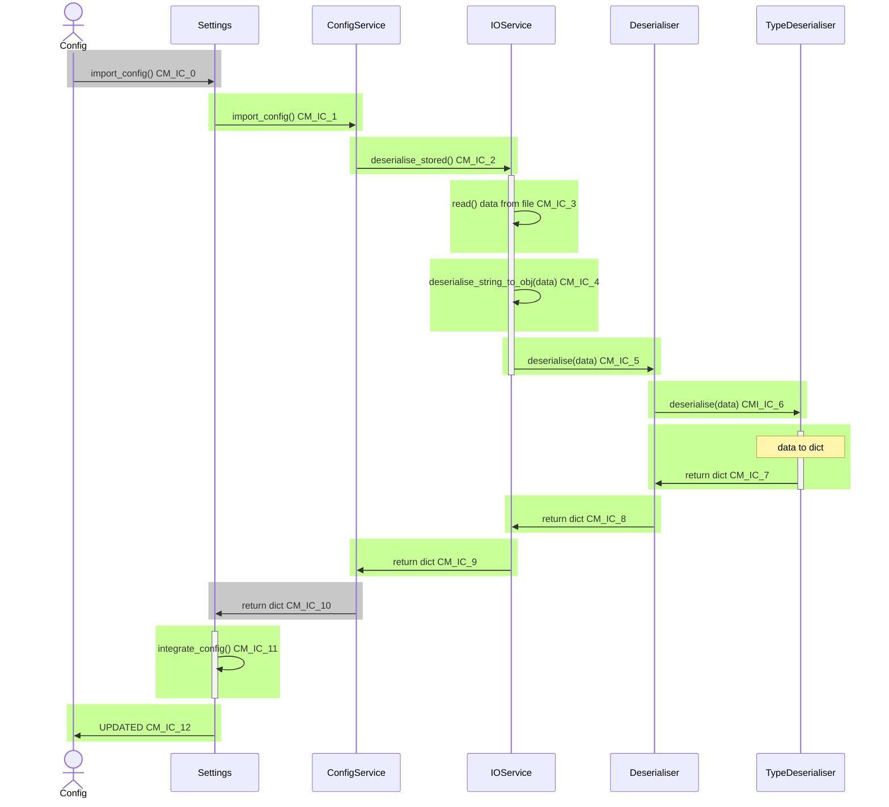
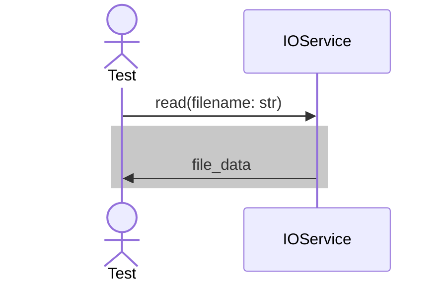
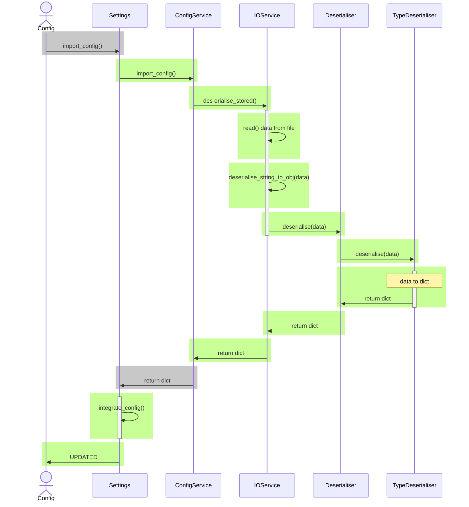

# EtymTreePython
A python project designed to allow input, display, and tracking of the vocabulary of a constructed language.

## Configuration (V1)

| Test Code | Information |
|-|-|
| CM_IC_0 | 
| |
| **CM_IC_1** | GivenEmptySettings
| | cm_ic_1_a_request_to_import_configuration_options_is_passed_on
| |
| **CM_IC_2** | GivenANewConfigService
| | CM_IC_2_AServiceWillCallDeserialiseStoredOnImport
| |
| **CM_IC_3** | GivenANewIOService
| | CM_IC_3_TheServiceCallsReadOnDeserialise
| |
| **CM_IC_4** | GivenANewIOService
| | CM_IC_4_TheServiceCallsDeserialiseStringToObjectOnDeserialise 
| |
| **CM_IC_5** | GivenAnIOServiceInJSONFormat
| | CM_IC_5_TheServiceWillCallDeserializeString
| |
| **CM_IC_6** | GivenADeserialiserInJSONFormat
| | CM_IC_6_AJSONDeserialiserIsCalled
| |
| **CM_IC_7** | GivenADeserialiserInJSONFormat 
| | CM_IC_7_AJSONStringCanBeDeserialised |
| |
| **CM_IC_8** | GivenADeserialiserInJSONFormat 
| | test_CM_IC_8_TheServiceWillDeserialiseAStoredString
| |
| **CM_IC_9** | GivenANewConfigService:
| | CM_IC_9_AServiceReturnADeserialisedObjectOnImport
| |
| **CM_IC_10** | GivenANewConfigManager
| | CM_IC_10_ImportConfigReturnsAConfigDictionary
| |
| **CM_IC_11** | GivenEmptySettings
| | test_when_a_valid_id_is_specified_then_the_expected_setting_value_is_returned
| |
| **CM_IC_12** | GivenAnExistingConfiguration
| | cm_ic_12_base_entries_are_overwritten_when_importing_config

## IOService Tests: IOS (./tests/test_io_service.py)

### IOService Read Tests: IOS-RDF

| Label | Path | Description | Include? | Complete
|-|-|-|-|-|
| IOS-RDF-00 | Happy | Reads data from file in UTF-8 | :heavy_check_mark: | No
| IOS-RDF-01 | Sad | File doesn't exist | :heavy_check_mark: | No
| IOS-RDF-02 | Bad | Incorrect file format | :x:

## Configuration

