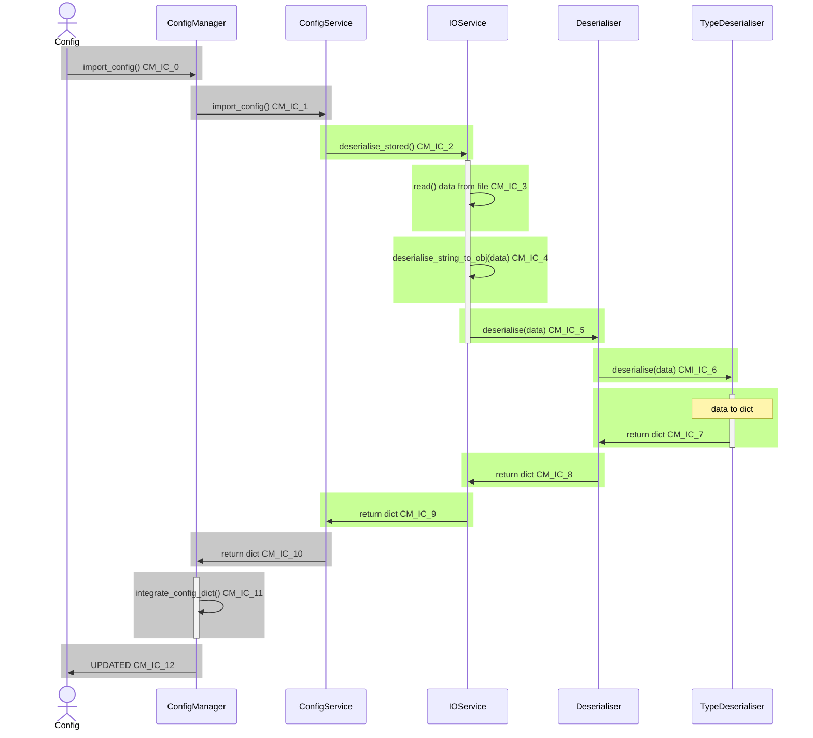

# EtymTreePython
A python designed to allow input, display, and tracking of the vocabulary of a constructed language.

## Configuration

| Test Code | Information |
|-|-|
| CM_IC_0 | 
| |
| CM_IC_1 |
| |
| **CM_IC_2** | GivenANewConfigService:
| | CM_IC_2_AServiceWillCallDeserialiseStoredOnImport
| |
| **CM_IC_3** | GivenANewIOService
| | CM_IC_3_TheServiceCallsReadOnDeserialise
| |
| **CM_IC_4** | GivenANewIOService
| | CM_IC_4_TheServiceCallsDeserialiseStringToObjectOnDeserialise 
| |
| **CM_IC_5** | GivenAnIOServiceInJSONFormat
| | CM_IC_5_TheServiceWillCallDeserializeString
| |
| **CM_IC_6** | GivenADeserialiserInJSONFormat
| | CM_IC_6_AJSONDeserialiserIsCalled
| |
| **CM_IC_7** | GivenADeserialiserInJSONFormat 
| | CM_IC_7_AJSONStringCanBeDeserialised |
| |
| **CM_IC_8** | GivenADeserialiserInJSONFormat 
| | test_CM_IC_8_TheServiceWillDeserialiseAStoredString
| |
| **CM_IC_9** | GivenANewConfigService:
| | CM_IC_9_AServiceReturnADeserialisedObjectOnImport
| |
| CM_IC_10 |
| |
| CM_IC_11 |
| |
| CM_IC_12 |
