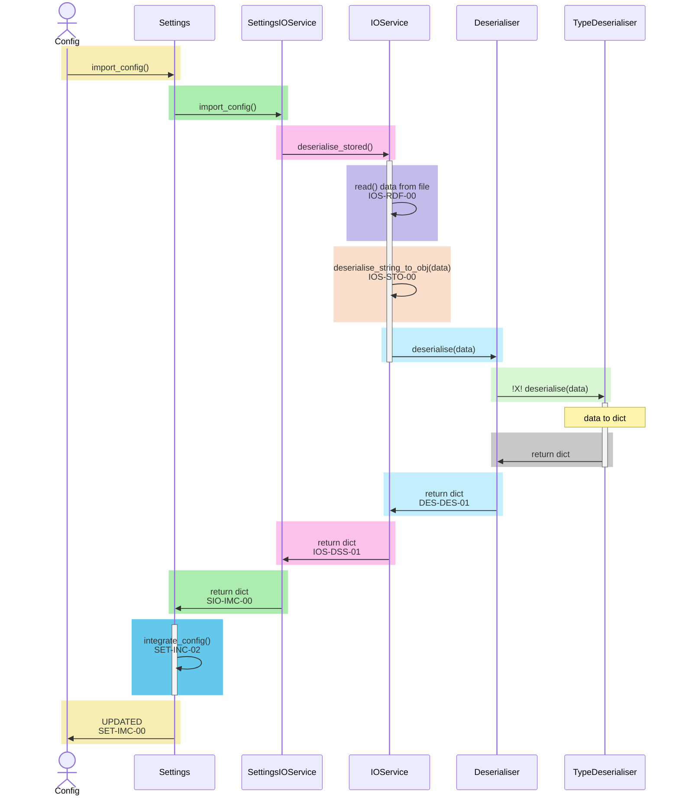
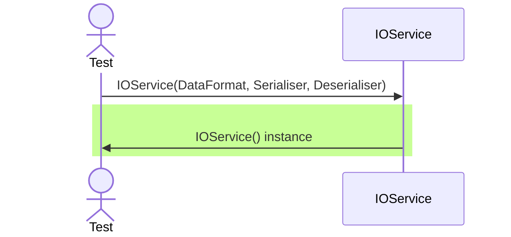
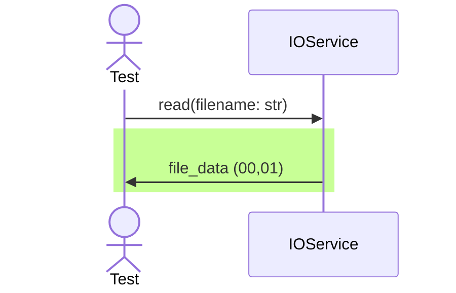
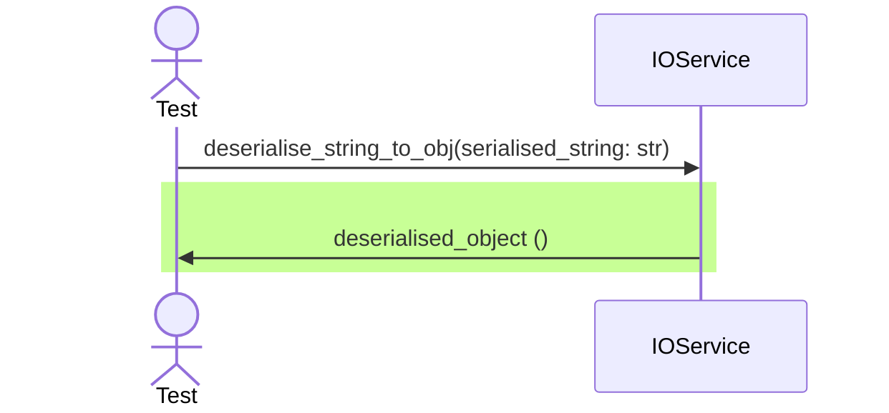
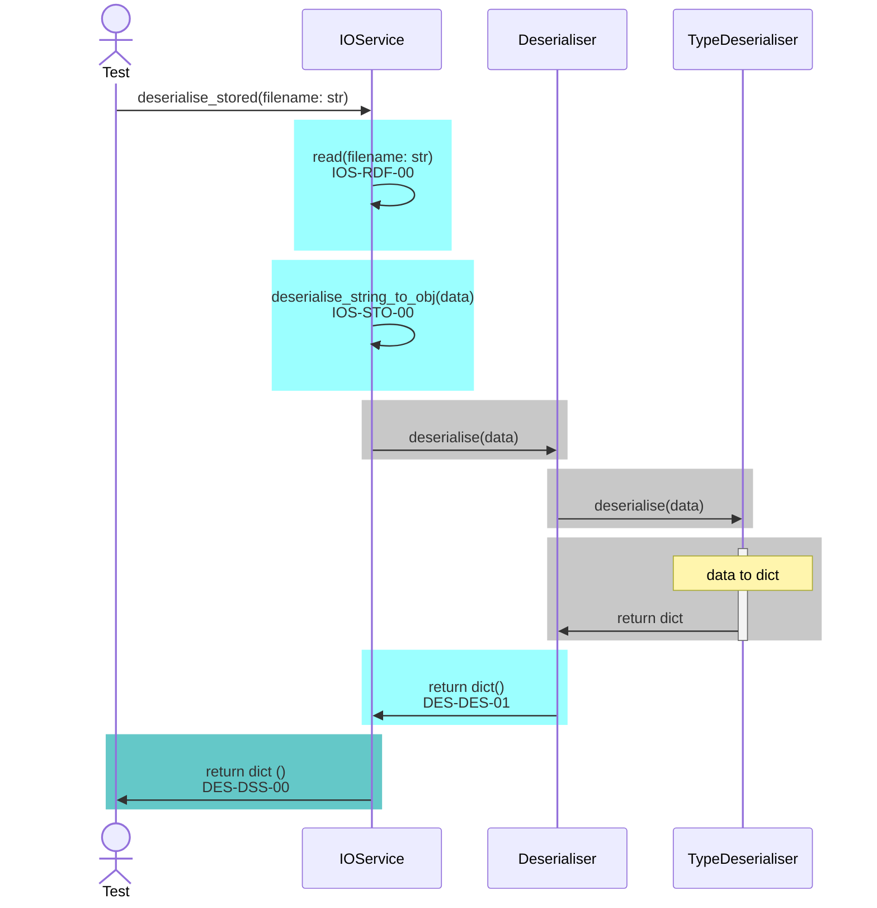
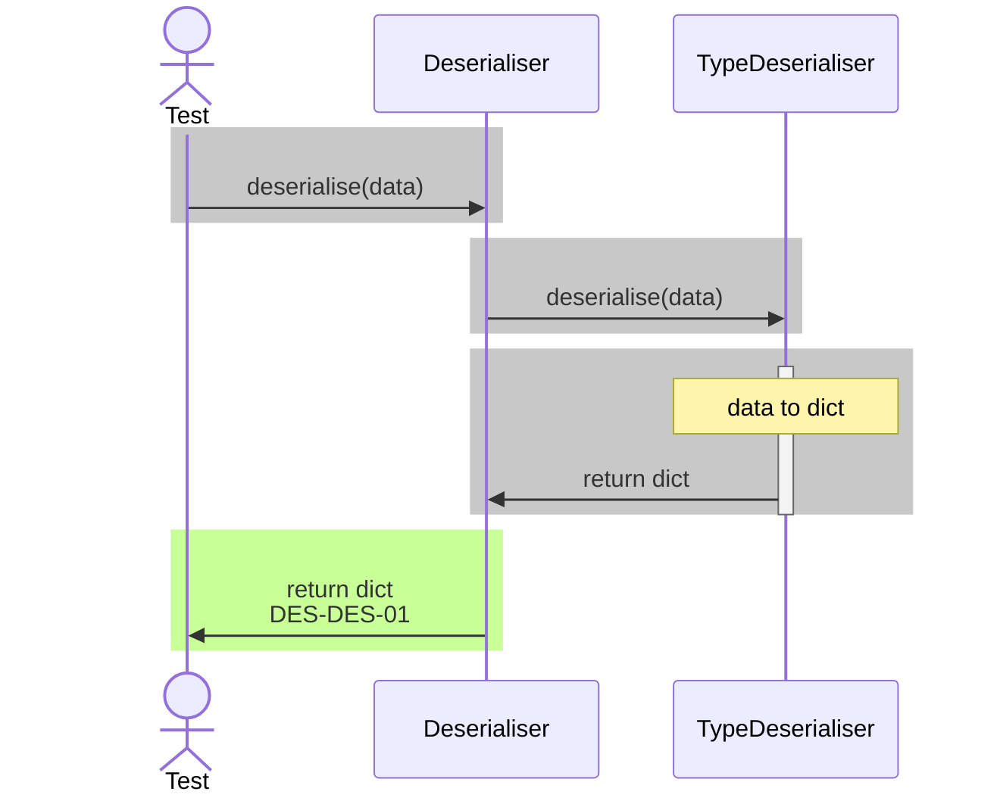
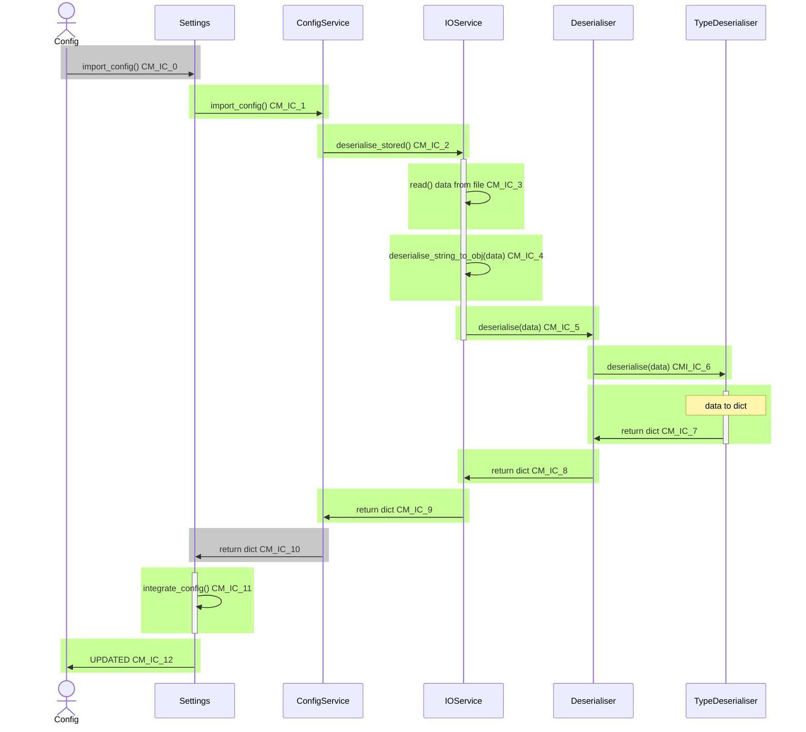

<style>.mermaid svg { height: auto; }</style>

# EtymTreePython
A python project designed to allow input, display, and tracking of the vocabulary of a constructed language.

## Installation

### Conda Environment Package Installation
At a prompt in which the (empty) environment has been created:
```
conda install python
pip install pylama[all]
conda install matplotlib
conda install networkx
conda install pytest
pip install pytest-qt
conda install pytest-mock
```

[TOC]

## Configuration Flow and Test Coverage


## Settings Tests: SET (./tests/test_settings.py)

### Settings - Instantiation Tests - SET-IST

| Label | Path | Description | Include? | Complete
|-|-|-|-|-|
| SET-IST-00 | Happy | Instantiates empty | :heavy_check_mark: | :heavy_check_mark:
| SET-IST-01 | Happy | Instantiates with configuration | :heavy_check_mark: | :heavy_check_mark:
| SET-IST-02 | Happy | Instantiates with context | :heavy_check_mark: | :heavy_check_mark:

### Settings - Integrate Config Tests - SET-INC

| Label | Path | Description | Include? | Complete
|-|-|-|-|-|
| SET-INC-00 | Happy | Clean integrates passed config values | :heavy_check_mark: | :heavy_check_mark:
| SET-INC-01 | Happy | Integrates empty config | :heavy_check_mark: | :heavy_check_mark:
| SET-INC-02 | Happy | Integrates config values with overwriting| :heavy_check_mark: | :heavy_check_mark:
| SET-INC-03 | Sad | Throws if integrating None | :heavy_check_mark: | :heavy_check_mark:
| SET-INC-04 | Bad | Throws if parameter is invalid | :heavy_check_mark: | :heavy_check_mark:

### Settings - Integrate Config Tests - SET-IMC

| Label | Path | Description | Include? | Complete
|-|-|-|-|-|
| SET-IMC-00 | Happy | Returns an integrated object from a valid filename | :heavy_check_mark: | :heavy_check_mark:

## SettingsIOService Tests: SIO (./tests/test_settings_io_service.py)

### SettingsIOService - Instantiation Tests - SIO-IST

| Label | Path | Description | Include? | Complete
|-|-|-|-|-|
| SIO-IST-00 | Happy | Instantiates with a provided IOService | :heavy_check_mark: | :heavy_check_mark:
| SIO-IST-01 | Happy | Instantiates with a provided DataFormat | :heavy_check_mark: | :heavy_check_mark:
| SIO-IST-02 | Sad | Throws if IOService AND DataFormat are not supplied | :heavy_check_mark: | :heavy_check_mark:


### SettingsIOService - Import Config Tests - SIO-IMC

| Label | Path | Description | Include? | Complete
|-|-|-|-|-|
| SIO-IMC-00 | Happy | Returns a deserialised object from a valid filename | :heavy_check_mark: | :heavy_check_mark:

## IOService Tests: IOS (./tests/test_io_service.py)

### IOService - Instantiation Tests: IOS-IST

| Label | Path | Description | Include? | Complete
|-|-|-|-|-|
| IOS-IST-00 | Happy | Instantiates without specified format | :heavy_check_mark: | :heavy_check_mark:
| IOS-IST-01 | Happy | Instantiates with a recognised DataFormat | :heavy_check_mark: | :heavy_check_mark:
| IOS-IST-05 | Happy | Uses supplied Serialiser | :x: |
| IOS-IST-06 | Happy | Uses supplied Deserialiser | :x: |

### IOService Read Tests: IOS-RDF


| Label | Path | Description | Include? | Complete
|-|-|-|-|-|
| IOS-RDF-00 | Happy | Reads data from file in UTF-8 | :heavy_check_mark: | :heavy_check_mark:
| IOS-RDF-01 | Sad | File doesn't exist | :heavy_check_mark: | :heavy_check_mark:
| IOS-RDF-02 | Bad | Incorrect file format | :x:


### IOService Deserialise String To Object Tests: IOS-STO


| Label | Path | Description | Include? | Complete
|-|-|-|-|-|
| IOS-STO-00 | Happy | Returns deserialised object from valid JSON string | :heavy_check_mark: | :heavy_check_mark:
| IOS-STO-01 | Sad | Returns empty when string is empty  | :heavy_check_mark: | :heavy_check_mark:
| IOS-STO-02 | Bad | Throws when None is passed | :heavy_check_mark: | :heavy_check_mark:

### IOService Tests - Deserialise Stored: IOS-DSS
Dependent on both IOS-RDF and ISO-STO



| Label | Path | Description | Include? | Complete
|-|-|-|-|-|
| IOS-DSS-00 | Happy | Returns deserialised object from valid file | :heavy_check_mark: | :heavy_check_mark:


## Serialiser Tests: SER (./tests/test_serialiser.py)

## Deserialiser Tests: DES (./tests/test_deserialiser.py)

### Deserialiser Instantiation Tests: DES-IST

| Label | Path | Description | Include? | Complete
|-|-|-|-|-|
| DES-IST-00 | Happy | Instantiates with a DataFormat specified | :heavy_check_mark: | :heavy_check_mark:
| DES-IST-01 | Sad | Throws on empty instantiation | :heavy_check_mark: | :heavy_check_mark:

### Deserialiser deserialise Tests: DES-DES



| Label | Path | Description | Include? | Complete
|-|-|-|-|-|
| DES-DES-00 | Bad | Throws on deserialise with invalid DataFormat | :heavy_check_mark: | :heavy_check_mark:
| DES-DES-01 | Happy | Returns deserialised object from valid JSON string | :heavy_check_mark: | :heavy_check_mark:
| DES-DES-02 | Happy | Returns empty object from empty string | :heavy_check_mark: | :heavy_check_mark:
| DES-DES-03 | Sad | Throws with None input | :heavy_check_mark: | :heavy_check_mark:


## Configuration (V1)


| Test Code | Information |
|-|-|
| CM_IC_0 | 
| |
| **CM_IC_1** | GivenEmptySettings
| | cm_ic_1_a_request_to_import_configuration_options_is_passed_on
| |
| **CM_IC_2** | GivenANewConfigService
| | CM_IC_2_AServiceWillCallDeserialiseStoredOnImport
| |
| **CM_IC_3** | GivenANewIOService
| | CM_IC_3_TheServiceCallsReadOnDeserialise
| |
| **CM_IC_4** | GivenANewIOService
| | CM_IC_4_TheServiceCallsDeserialiseStringToObjectOnDeserialise 
| |
| **CM_IC_5** | GivenAnIOServiceInJSONFormat
| | CM_IC_5_TheServiceWillCallDeserializeString
| |
| **CM_IC_6** | GivenADeserialiserInJSONFormat
| | CM_IC_6_AJSONDeserialiserIsCalled
| |
| **CM_IC_7** | GivenADeserialiserInJSONFormat 
| | CM_IC_7_AJSONStringCanBeDeserialised |
| |
| **CM_IC_8** | GivenADeserialiserInJSONFormat 
| | test_CM_IC_8_TheServiceWillDeserialiseAStoredString
| |
| **CM_IC_9** | GivenANewConfigService:
| | CM_IC_9_AServiceReturnADeserialisedObjectOnImport
| |
| **CM_IC_10** | GivenANewConfigManager
| | CM_IC_10_ImportConfigReturnsAConfigDictionary
| |
| **CM_IC_11** | GivenEmptySettings
| | test_when_a_valid_id_is_specified_then_the_expected_setting_value_is_returned
| |
| **CM_IC_12** | GivenAnExistingConfiguration
| | cm_ic_12_base_entries_are_overwritten_when_importing_config